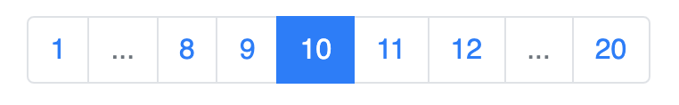

# React Bootstrap Pagination Logic

> Simple to use component that takes care of all the logic involved on creating the UI for a pagination system using Bootstrap 4 for the styling

[](https://www.npmjs.com/package/react-bootstrap-pagination-logic) [](https://standardjs.com)

## Install

```bash
npm install --save react-bootstrap-pagination-logic
```

## Usage

```jsx
import React, { Component } from 'react'
import Pagination from 'react-bootstrap-pagination-logic'

class Example extends Component {

  handlePageChange = (page) => {
    // your code here ...
    console.log(page)
  }

  render () {
    return (
      <Pagination
        current_page={10}
        last_page={20}
        position="center"
        handlePageChange={this.handlePageChange} />
    )
  }

}
```
## Final Result


## License

MIT © [euobrunocosta](https://github.com/euobrunocosta)
